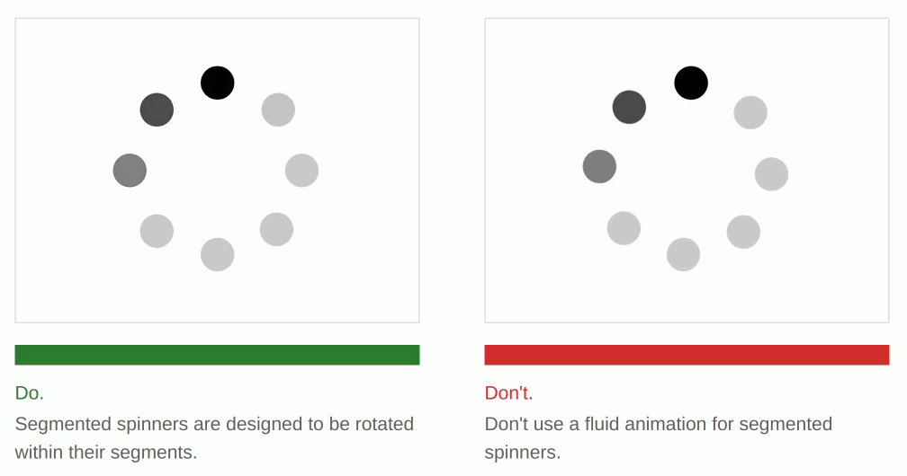

# Please, Fix Your Spinner.

[pleasefixyourspinner.com](pleasefixyourspinner.com)

Segmented spinners such as the "8 dot spinner" are intended to be animated in a pulsing fashion rather than rotated with a fluid, linear animation. Show your users that you pay attention to detail by making this simple change.

> **Using FontAwesome?** Great! All you have to do is change the class on your spinner from `fa-spin` to `fa-pulse`!